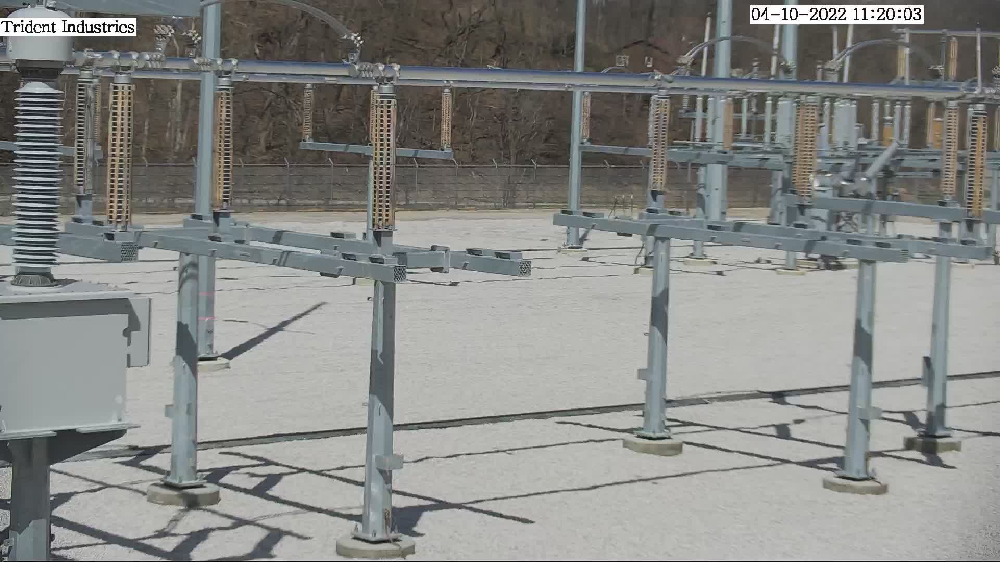
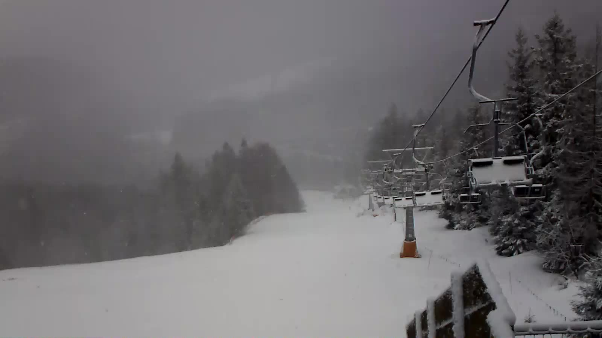
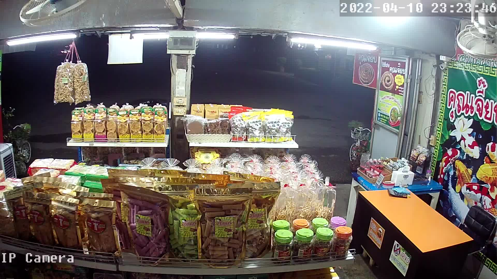

# Netstalking tools

## Features

### Netrandom

- RTSP fuzzer
- HTTP fuzzer
- HTTP headers, body regexp matching test
- random WAN IP generator
- random WAN IP port (range) scanner

### Gathering

- callback command support for each result
- CIDR-notation network scan in random order

[](https://www.dumels.com/diagram/e32e5a35-9583-4902-aeef-82011e033de1)
[](https://goreportcard.com/report/github.com/fagci/gons)

## Loot examples

### RTSP

   

### HTTP mjpeg

[IT, Liguria, Albenga](http://185.85.25.87/mjpg/video.mjpg) - mountains, houses   
[ES, Murcia, Murcia](http://45.66.52.41/mjpg/video.mjpg) - golf field

## Usage examples

### General

Generate 5 random wan IPs:

```sh
./gons -n 5
```

### RTSP

Netrandom find possible RTSP sources:

```sh
./gons -s rtsp
```

Take snapshots from RTSP stream and write source URL in metadata:

```sh
./gons -s rtsp -cb 'bash ./assets/callbacks/capture.sh "{result}" "/sdcard/Pictures/RTSP/" "{slug}"'
```

### Custom ports

Scan 1024 random WAN IPs for open VNC ports:

```sh
./gons -n 1024 -s portscan -ports 5900-5902
```

### Subnets

Scan local subnet for http(s) servers:

```sh
./gons -net 192.168.0.1/24 -s portscan -p 80,443
```

Scan subnet for RTSP servers:

```sh
./gons -net 192.168.0.1/24 -s rtsp
```

Scan list of networks and hosts:

```sh
./gons -list city_cidrs.txt -s rtsp
```

```sh
cat city_cidrs.txt | ./gons -s rtsp -list -
```

### HTTP, regexps

Search for public resources over http:

```sh
./gons -s http -d ./assets/data/http-pub-paths.txt -rb "Index of"
```

Search for public mjpeg webcams:

```sh
./gons -s http -d ./assets/data/http-cam-paths.txt -rh "(image/jpeg|multipart/x-mixed-replace)"
```

## Build

You can download [latest release](https://github.com/fagci/gons/releases), or build yourself:

```sh
go build
```

To get smaller binary:

```sh
go build -ldflags="-s -w"
```

## Testing

```sh
go test -v ./...
```
